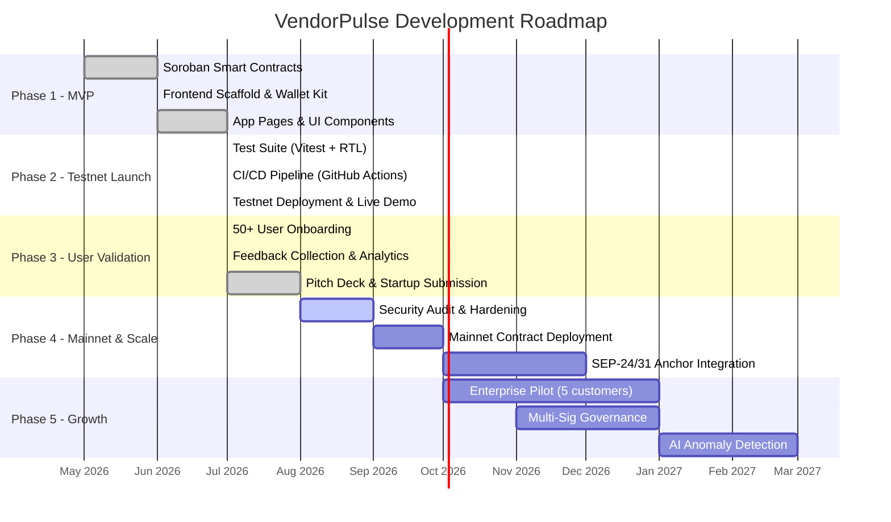

# VendorPulse — Milestone Roadmap

> Structured milestone breakdown for the Stellar Startup Track submission. Each milestone is mapped to deliverables, success metrics, and estimated timelines.

---

## Milestone Overview

---

## Milestone 1: MVP Completion ✅ Complete

**Timeline**: May 2026 – July 2026
**Status**: ✅ Delivered

### Deliverables

| # | Deliverable | Git Commit | Status |
| :-: | :--- | :--- | :-: |
| 1.1 | Soroban `VendorRegistry` contract (Rust) — vendor registration, status management, RBAC, state machine validation | [`71f009e`](https://github.com/ashishh-tech/stellar-vendorpulse/commit/71f009e) | ✅ |
| 1.2 | Soroban `ReviewSystem` contract (Rust) — review submission, multi-axis scoring, reviewer authorization | [`71f009e`](https://github.com/ashishh-tech/stellar-vendorpulse/commit/71f009e) | ✅ |
| 1.3 | Inter-contract communication (`ReviewSystem` → `VendorRegistry.update_vendor_score()`) | [`71f009e`](https://github.com/ashishh-tech/stellar-vendorpulse/commit/71f009e) | ✅ |
| 1.4 | Frontend scaffold: Next.js 15, Wallet Kit, Contract Service Layer, Event Streaming | [`7a040ab`](https://github.com/ashishh-tech/stellar-vendorpulse/commit/7a040ab) | ✅ |
| 1.5 | Complete app pages: Landing, Dashboard, Activity Feed, Analytics, Settings | [`6a05414`](https://github.com/ashishh-tech/stellar-vendorpulse/commit/6a05414) | ✅ |
| 1.6 | Freighter wallet integration (`@stellar/freighter-api`) | [`7a040ab`](https://github.com/ashishh-tech/stellar-vendorpulse/commit/7a040ab) | ✅ |

### Success Metrics
- ✅ 2 independent Soroban smart contracts compiled and deployed to Testnet
- ✅ Inter-contract call execution verified on-chain
- ✅ Wallet connect → sign → confirm flow working end-to-end

---

## Milestone 2: Testnet Launch & Quality Assurance ✅ Complete

**Timeline**: July 2026
**Status**: ✅ Delivered

### Deliverables

| # | Deliverable | Git Commit | Status |
| :-: | :--- | :--- | :-: |
| 2.1 | Vitest + React Testing Library test suite (9 tests, 4 test files) | [`af1255f`](https://github.com/ashishh-tech/stellar-vendorpulse/commit/af1255f) | ✅ |
| 2.2 | GitHub Actions CI/CD pipeline (PR checks + deployment) | [`0a8ea0e`](https://github.com/ashishh-tech/stellar-vendorpulse/commit/0a8ea0e) | ✅ |
| 2.3 | Live Activity Feed with real-time Soroban RPC `getEvents` streaming | [`251c6f4`](https://github.com/ashishh-tech/stellar-vendorpulse/commit/251c6f4) | ✅ |
| 2.4 | Testnet contract deployment (VendorRegistry + ReviewSystem) | [`7e51b7b`](https://github.com/ashishh-tech/stellar-vendorpulse/commit/7e51b7b) | ✅ |
| 2.5 | Live demo deployment on Netlify | [`b62f7c7`](https://github.com/ashishh-tech/stellar-vendorpulse/commit/b62f7c7) | ✅ |

### Success Metrics
- ✅ 9/9 automated tests passing consistently
- ✅ CI pipeline runs on every PR and push
- ✅ Live demo accessible at [stellar-vendorpulse.netlify.app](https://stellar-vendorpulse.netlify.app)
- ✅ 10+ verified on-chain wallet interactions documented

---

## Milestone 3: User Validation & Startup Submission ✅ Complete

**Timeline**: July 2026
**Status**: ✅ Delivered

### Deliverables

| # | Deliverable | Git Commit | Status |
| :-: | :--- | :--- | :-: |
| 3.1 | 53 verified user onboarding records (CSV export) | [`5e8ee4c`](https://github.com/ashishh-tech/stellar-vendorpulse/commit/5e8ee4c) | ✅ |
| 3.2 | In-app feedback module with ratings, categories, and CSV export | [`3c33d19`](https://github.com/ashishh-tech/stellar-vendorpulse/commit/3c33d19) | ✅ |
| 3.3 | Pitch Deck (VendorPulse_Pitch_Deck.pptx) | [`5e8ee4c`](https://github.com/ashishh-tech/stellar-vendorpulse/commit/5e8ee4c) | ✅ |
| 3.4 | Startup Executive Summary & Milestone Roadmap | *This commit* | ✅ |
| 3.5 | GitHub analytics telemetry (167 clones, 73 unique cloners) | [`3c33d19`](https://github.com/ashishh-tech/stellar-vendorpulse/commit/3c33d19) | ✅ |

### Success Metrics
- ✅ 50+ onboarded users with verified wallet addresses and feedback
- ✅ 4.8/5.0 average user satisfaction rating
- ✅ Complete startup submission package ready

---

## Milestone 4: Security Audit & Mainnet Deployment 🔜 In Progress

**Timeline**: August – October 2026
**Status**: 🔜 Planned
**Funding Required**: $10,000–$15,000

### Deliverables

| # | Deliverable | Timeline | Status |
| :-: | :--- | :--- | :-: |
| 4.1 | Smart contract security audit (reentrancy, overflow, auth bypass, storage isolation) | Aug 2026 | 🔜 |
| 4.2 | Security hardening based on audit findings | Sep 2026 | 🔜 |
| 4.3 | Mainnet contract deployment (VendorRegistry + ReviewSystem) | Sep 2026 | 🔜 |
| 4.4 | Mainnet wallet configuration and fee estimation | Sep 2026 | 🔜 |
| 4.5 | SEP-24/SEP-31 Anchor integration for USDC vendor payments | Oct–Dec 2026 | 🔜 |

### Success Metrics
- [ ] Zero critical or high-severity vulnerabilities in audit report
- [ ] Both contracts deployed and verified on Stellar Mainnet
- [ ] At least 1 successful USDC payment settlement via SEP anchor

---

## Milestone 5: Enterprise Growth & Scaling 🔜 Planned

**Timeline**: October 2026 – March 2027
**Status**: 🔜 Planned
**Funding Required**: $15,000–$35,000

### Deliverables

| # | Deliverable | Timeline | Status |
| :-: | :--- | :--- | :-: |
| 5.1 | Onboard 5 enterprise pilot customers (mid-market manufacturing/logistics) | Oct 2026 – Jan 2027 | 🔜 |
| 5.2 | Multi-signature governance for vendor status changes | Nov 2026 – Jan 2027 | 🔜 |
| 5.3 | Fee sponsorship (gasless transactions via fee-bump) | Nov 2026 | 🔜 |
| 5.4 | AI-powered anomaly detection for vendor score drift | Jan – Mar 2027 | 🔜 |
| 5.5 | Account abstraction with smart wallet custom auth | Feb – Mar 2027 | 🔜 |
| 5.6 | Revenue milestone: $10K MRR | Mar 2027 | 🔜 |

### Success Metrics
- [ ] 5 paying enterprise customers
- [ ] 20+ Mainnet users with verified transactions
- [ ] $10K monthly recurring revenue
- [ ] Multi-sig governance operational on Mainnet

---

## Budget Summary

| Phase | Milestone | Budget Request | Purpose |
| :-: | :--- | :--- | :--- |
| **Phase 1–3** | MVP + Testnet + Validation | $0 (Self-funded) | ✅ Complete |
| **Phase 4** | Security Audit + Mainnet | $10,000–$15,000 | Third-party audit, Mainnet XLM, SEP integration |
| **Phase 5** | Enterprise Growth | $15,000–$35,000 | Sales, pilot customer onboarding, advanced features |
| **Total** | | **$25,000–$50,000** | Full execution through revenue milestone |

---

## Key Risks & Mitigations

| Risk | Likelihood | Impact | Mitigation |
| :--- | :-: | :-: | :--- |
| Smart contract vulnerability | Medium | High | Third-party security audit + formal verification |
| Slow enterprise adoption | Medium | High | Free pilot program with guaranteed ROI measurement |
| Stellar network congestion | Low | Medium | Fee-bump sponsorship + transaction queue management |
| Competitor entry | Medium | Medium | First-mover advantage on blockchain-verified vendor scoring |
| Team scaling challenges | Medium | Medium | Stellar mentorship program + co-founder recruitment |

---

*This roadmap is designed to be reviewed and refined collaboratively with the Stellar Builder Team as part of the Startup Track program.*
