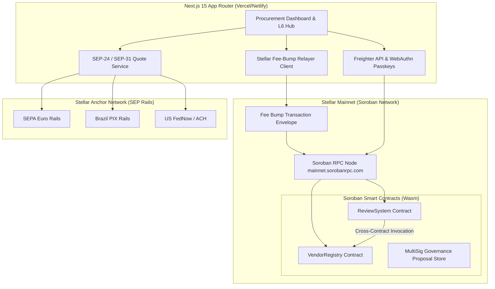

# 📐 VendorPulse Technical Specification & Protocol Architecture

> **Complete system architecture, Soroban XDR types, RPC bindings, data structures, and protocol design for Stellar Mainnet.**

---

## 1. System Architecture Diagram



---

## 2. Soroban Data Structures & XDR Types

### 2.1 Vendor Data Key & Struct
```rust
#[contracttype]
#[derive(Clone, Debug, Eq, PartialEq)]
pub enum VendorStatus {
    Pending = 0,
    Active = 1,
    Suspended = 2,
    Decommissioned = 3,
}

#[contracttype]
#[derive(Clone, Debug, Eq, PartialEq)]
pub struct VendorScores {
    pub delivery: u32,
    pub quality: u32,
    pub payment: u32,
    pub communication: u32,
    pub total_reviews: u32,
}

#[contracttype]
#[derive(Clone, Debug, Eq, PartialEq)]
pub struct VendorRecord {
    pub id: u64,
    pub name: String,
    pub category: String,
    pub contact_email: String,
    pub status: VendorStatus,
    pub scores: VendorScores,
    pub created_at: u64,
    pub updated_at: u64,
}
```

### 2.2 Review Record Struct
```rust
#[contracttype]
#[derive(Clone, Debug, Eq, PartialEq)]
pub struct ReviewRecord {
    pub review_id: u64,
    pub vendor_id: u64,
    pub reviewer: Address,
    pub delivery_score: u32,
    pub quality_score: u32,
    pub payment_score: u32,
    pub communication_score: u32,
    pub comment_hash: BytesN<32>,
    pub timestamp: u64,
}
```

---

## 3. Inter-Contract Communication Flow

1. Evaluator calls `ReviewSystem::submit_review(vendor_id, scores, reviewer)`.
2. `ReviewSystem` calculates the incremental moving average for the target vendor.
3. `ReviewSystem` invokes `VendorRegistry::update_vendor_score(vendor_id, updated_scores)`.
4. `VendorRegistry` verifies that `env.invoker() == review_contract_address`.
5. `VendorRegistry` commits the updated scores to Persistent storage and emits `vendor_score_updated` event.

---

## 4. Mainnet Deployment Parameters

- **Soroban Network RPC**: `https://mainnet.sorobanrpc.com`
- **Horizon API**: `https://horizon.stellar.org`
- **Network Passphrase**: `Public Global Stellar Network ; September 2015`
- **Base Fee**: `100 Stroops` (Normal) | `10,000 Stroops` (Fee-bump sponsored)
